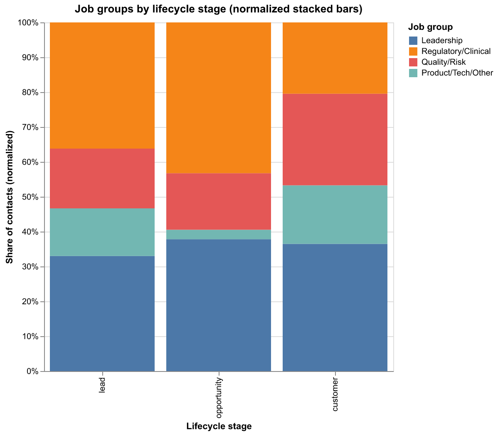

**Data privacy note:** The dataset was **never shared with or accessible to any AI tool**. All AI assistance was limited to general guidance, code scaffolding, and write-up phrasing; all analysis was performed locally on my machine.

## AI usage note 

- **ChatGPT:** generated the initial EDA outline and DuckDB setup (see `AI_generated_parts/` in the project).
- **GitHub Copilot:** used for a minor code fixes and comments in `main.ipynb`, plus generating code for the final visualization.
- **ChatGPT:** helped refine and write a concise final write-up.

## Q1: How many customers do we have today?

**Assumption:** “Customers today” = companies with **active deals** (not just records marked as `customers` in `hubspot_contacts`).

**Answer:** **26 customers** as of today.  
**Note:** *GenomaTech AG* and *KineMed S.L.* are **excluded**, even though they are marked as “customers” in the database.

---

## Q2: What is our Average Contract Value (ACV)?

**Assumptions:**
- Include deals that were **initially won** (even if they were later cancelled / became lost), assuming payment occurred.
- ACV is calculated **by contract type** (`Annual License`, `Upsell`) and **overall**.
- `Upsell` is assumed to be a **1-year** contract.
- `Expansion` deals did not reach **Won**, so they are **not included**.

**Answer (EUR):**

| contract_type  | n_deals | total_amount | contract_type_ACV_euros | Total_ACV_euros |
|---|---:|---:|---:|---:|
| Annual License | 28 | 370,000 | 13,214.29 | 12,727.27 |
| Upsell         | 5  | 50,000  | 10,000.00 | 12,727.27 |

---

## Q3: What is the retention of our users?

**Assumptions:**
- `user_id` is stable; the registration email mapped to `user_id` is still valid today.
- Retention is measured for one cohort: **customer users active on 2026-01-01**, tracked weekly until today.
- A user is **active** if they perform **≥ 1 meaningful action** in the week.
- Excluded (non-meaningful) events: `TokenGenerated`, `UserCreated`, `UserUpdated`, `OrganizationCreated`, `OrganizationUpdated`.

**Answer (weekly retention):**

| cohort_yearweek | week_index | n_users_active | cohort_size | retention_pct |
|---|---:|---:|---:|---:|
| 202601 | 0 | 91 | 91 | 100.00 |
| 202601 | 1 | 87 | 91 | 95.60 |
| 202601 | 2 | 81 | 91 | 89.01 |
| 202601 | 3 | 85 | 91 | 93.41 |
| 202601 | 4 | 82 | 91 | 90.11 |
| 202601 | 5 | 83 | 91 | 91.21 |

---

## Bonus: One additional insight

**Idea:** Compare the distribution of **job_title groups** across **lifecycle stages**, reducing 18 job titles into **4 broader groups**.

**Finding:** The role mix for **Customers** differs from earlier stages. For example, **Regulatory/Clinical** is lower among Customers (**~20%**) vs **~40%** in **Lead** and **Opportunity**.

**Hypothesis / implication:** To improve conversion, we may need to engage (at Lead/Opportunity stages) a user mix that more closely matches the eventual **Customer** audience.

### Job-title groups by lifecycle stage

**Interactive version:**  
[LINK](https://vitalii-novikov.github.io/bi-technical-challenge/job_groups_by_stage.html)

